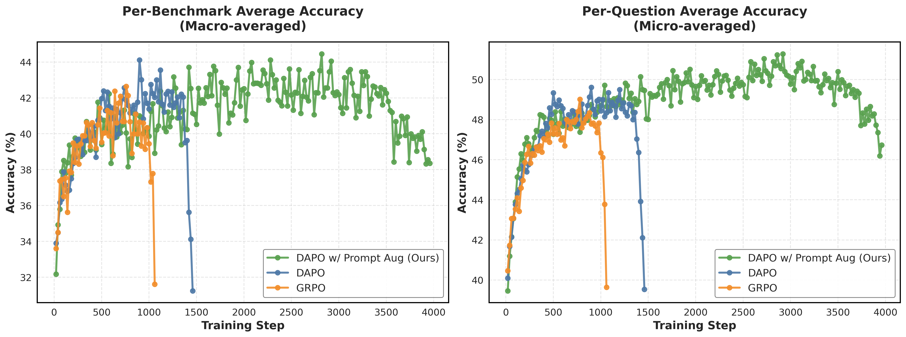
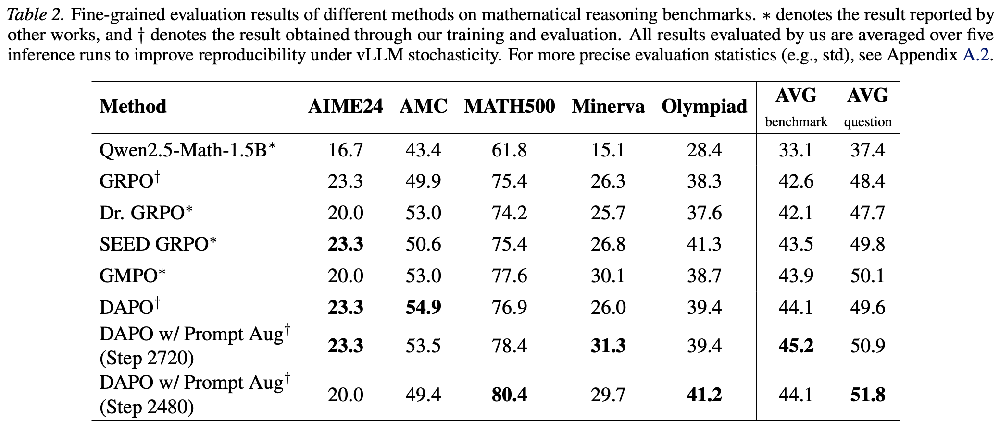

# Prompt Augmentation Scales up GRPO Training on Mathematical Reasoning

## News
**2026.02.03**
The paper is posted on [arxiv](https://arxiv.org/abs/2602.03190)! We are actively working on applying prompt augmentation to 7B models.

**2026.02.05**
We have updated our results on arxiv with a higher SOTA for 1.5B model. 🚀

## Introduction
Reinforcement learning algorithms such as group-relative policy optimization (GRPO) have demonstrated strong potential for improving the mathematical reasoning capabilities of large language models. However, prior work has consistently observed an entropy collapse phenomenon during reinforcement post-training, characterized by a monotonic decrease in policy entropy that ultimately leads to training instability and collapse. As a result, most existing approaches restrict training to short horizons (typically 5–20 epochs), limiting sustained exploration and hindering further policy improvement. In addition, nearly all prior work relies on a single, fixed reasoning prompt or template during training. In this work, we introduce prompt augmentation, a training strategy that instructs the model to generate reasoning traces under diverse templates and formats, thereby increasing rollout diversity. We show that, without a KL regularization term, prompt augmentation enables stable scaling of training duration under a fixed dataset and allows the model to tolerate low-entropy regimes without premature collapse. Empirically, a Qwen2.5-Math-1.5B model trained with prompt augmentation on the MATH Level 3–5 dataset achieves state-of-the-art performance, reaching 45.2 per-benchmark accuracy and 51.8 per-question accuracy on standard mathematical reasoning benchmarks, including AIME24, AMC, MATH500, Minerva, and OlympiadBench.

## Results
<p align="center">

</p>
<p align="center">

</p>

## Weights 🏋🏻‍♂️
- [DAPO w/ Prompt Augmentation Step 2720 (SOTA per-benchmark accuracy)](https://huggingface.co/daviddavidlu/DAPO-with-prompt-augmentation-step2720)

- [DAPO w/ Prompt Augmentation Step 2480 (SOTA per-question accuracy, 80+ on MATH500!)](https://huggingface.co/daviddavidlu/DAPO-with-prompt-augmentation-step2480)

- [DAPO w/ Prompt Augmentation Step 2820 (outdated)](https://huggingface.co/daviddavidlu/DAPO-with-prompt-augmentation-step2820)


## Training
**Wandb training logs for experiments**: [here](https://api.wandb.ai/links/wenquan_lu-brown-university/s6fqzr6r).

First install required packages for [verl](https://github.com/verl-project/verl) following their installation instructions. Our project is developed on top of [this version](https://github.com/verl-project/verl/commit/52fc6747f4d52f7b1fca900dbb98a2caf93e0595) of verl, using conda environment. We have provided our [environment.yml](./environment.yml).


To train the model with prompt augmetation:

```bash
sbatch examples/grpo_trainer/run_qwen2_5_math_1_5b.sh
```

To convert checkpoints to huggingface format
```
sbatch convert_model.sh
```

## Evaluation

To evaluate the trained model:

```bash
sbatch eval/eval_iterative.sh
```
We use greedy decoding with average of 5 inference results as our final reported result due to the stochasticity of vLLM inference engine.

To evaluate our provided checkpoint, first fill in the downloaded checkpoint path in eval/eval_checkpoint.sh, then run:
```bash
sbatch eval/eval_checkpoint.sh
```

## Important Q&A

<ul>
<li> <b>Why other papers do not show collapse in their graphs?</b></li>

You might wonder, why the other papers do not show the collapse in their graphs. Well, my take is if some paper show up to 500 steps, then what will happen at 1500 steps (or 5000 steps) is not shown. If you can keep a model stably training on a dataset for infinite steps in reinforcement learning setting without performance degeneracy, then I think it would be a major breakthrough (that is very continual-learning, AGI-vibe 🤖🧠). That's why I think scaling up the training duration is important to extract the most juice out of a given dataset.

</ul>

## Comments

Our codebase builds heavily on [verl](https://github.com/verl-project/verl), [understand-r1-zero](https://github.com/sail-sg/understand-r1-zero/tree/main) and [TreePO](https://github.com/multimodal-art-projection/TreePO). Thanks to their great works!

## Citation

If you find this repository helpful, please consider giving this repo a star :star: and citing:
```
@misc{lu2026promptaugmentationscalesgrpo,
      title={Prompt Augmentation Scales up GRPO Training on Mathematical Reasoning}, 
      author={Wenquan Lu and Hai Huang and Randall Balestriero},
      journal={arXiv preprint arXiv:2602.03190}
      year={2026},
}
```